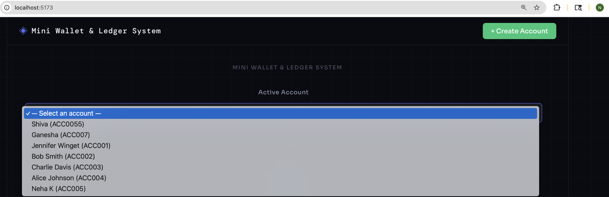
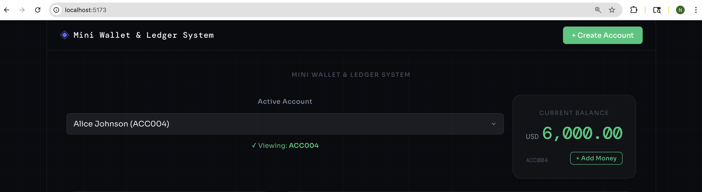
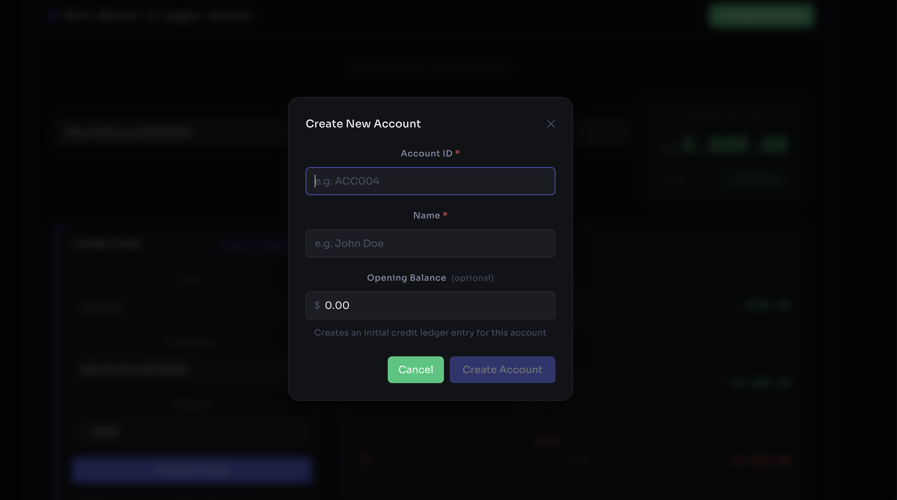
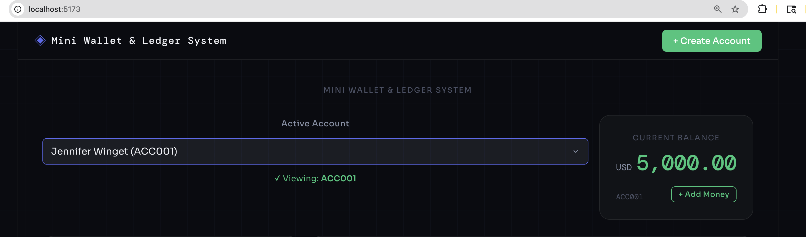
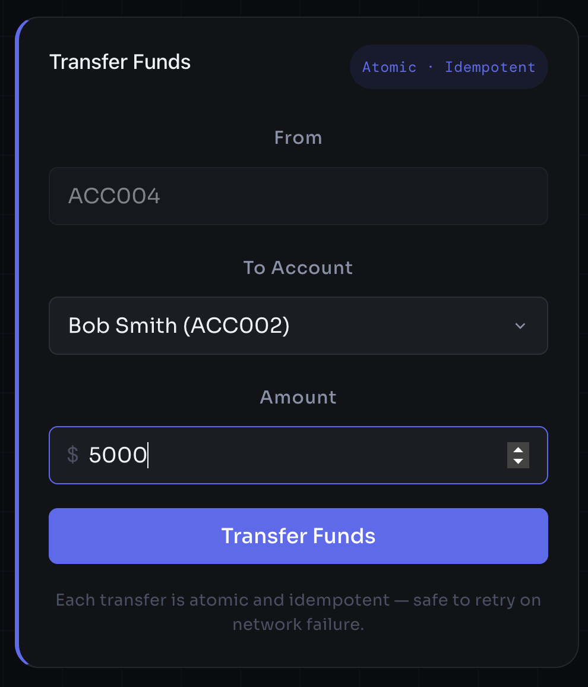
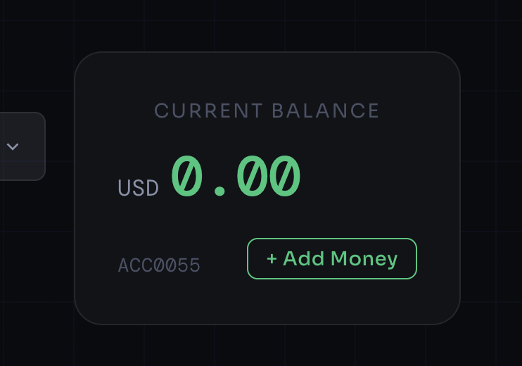
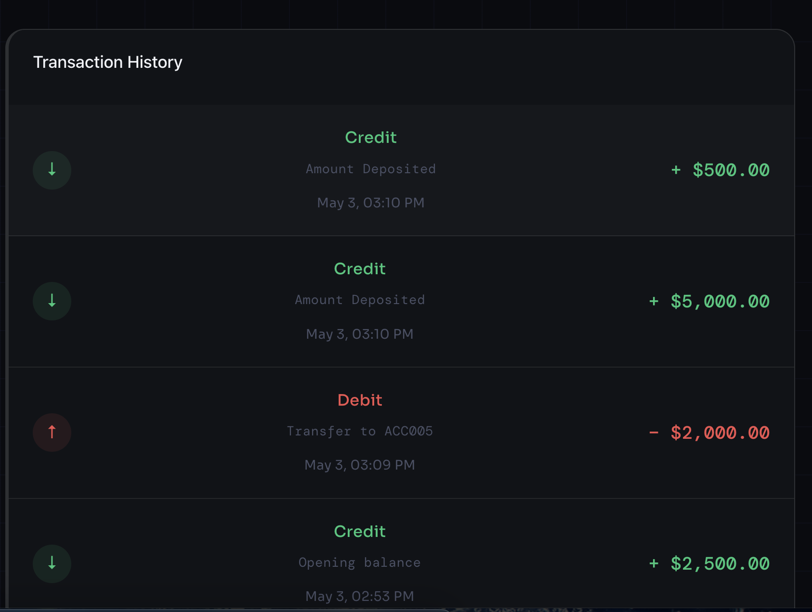

# wallet-ledger-system
A full-stack financial system built with Laravel (backend), React (frontend), and MySQL (database). Implements account management, atomic money transfers, deposit functionality, and transaction history with a ledger-based architecture.

---
## Features
- Create Account with Opening Balance
- Deposit Money (Ledger-based credit entry)
- Transfer Funds (Atomic & Idempotent)
- Transaction History
- Balance Calculation (Derived from ledger entries)
- API Security using Token-based Authentication
- Input Validation with User-Friendly Messages
- Dockerized Setup (PHP, MySQL, Nginx)

---
## Tech Stack
Backend:
- Laravel 12+
- MySQL 8
- REST APIs

Frontend:
- React (Vite)
- React Query
- Axios

DevOps:
- Docker + Docker Compose

---

## Project Structure

wallet-ledger-system/

├── backend/ 
   
├── frontend/
  
└── README.md

└── AI_USAGE.md


---

## Setup Instructions

---

##  Prerequisites

* PHP >= 8.2, Composer
* Node.js >= 18, npm
* Docker & Docker Compose

---

## 1. Clone Repository

```bash
git clone https://github.com/Neha-Khemchandani-52/wallet-ledger-system.git

cd wallet-ledger-system
```

---

##  2. Backend Setup (Laravel)

```bash
cd backend

composer install

cp .env.example .env
```

> Update `.env` if needed (DB credentials & API token are pre-configured for local Docker setup)

> Note : Dummy token is given in .env.example file for testing that you can use as it is in .env for testing wallet-ledger-system app, because it's not sensitive one, that's why added in .env.example file.

---


##  3. Start Docker Containers

```bash
docker-compose up -d --build
docker ps
docker ps
```

---

##  4. Initialize Application with Docker Setup
##  4. Initialize Application 

Imp Note : Since the application runs inside Docker, Artisan commands must be executed inside the container.
Imp Note : Since the application runs inside Docker, Artisan commands must be executed inside the container.

```bash
## Docker command for moving inside Docker container
docker-compose exec app bash

## Docker command for moving inside Docker container
docker-compose exec app bash

# Generate application key
php artisan key:generate

### First Time Setup, If you encounter cache/session/view errors, run:

mkdir -p storage/framework/{cache,sessions,views}
mkdir -p bootstrap/cache
chmod -R 775 storage bootstrap/cache
php artisan optimize:clear
php artisan key:generate

### First Time Setup, If you encounter cache/session/view errors, run:

mkdir -p storage/framework/{cache,sessions,views}
mkdir -p bootstrap/cache
chmod -R 775 storage bootstrap/cache
php artisan optimize:clear

# Run migrations
php artisan migrate

# Seed test data
php artisan migrate --seed
php artisan migrate

# Seed test data
php artisan migrate --seed

php artisan serve
php artisan serve
```

---

##  Backend Access

http://localhost:8000


---

## 5. Frontend Setup (React)

```bash
# Open new terminal window
cd wallet-ledger-system
cd frontend
# Open new terminal window
cd wallet-ledger-system
cd frontend

# Install dependencies
npm install

# Copy environment file
cp .env.example .env
```

---

### Configure Frontend Environment
### Configure Frontend Environment

Inside `.env` file :
Inside `.env` file :

```env
VITE_API_URL=http://localhost:8000/api/v1
VITE_API_KEY=secret-token-here
```

> `VITE_API_KEY` must match with `API_TOKEN` in backend `.env`
> `VITE_API_KEY` must match with `API_TOKEN` in backend `.env`

---

## Start Frontend

```bash
npm run dev
```

Frontend runs at: http://localhost:5173


---


---


## API Documentation

All endpoints require the header:
```
X-API-KEY: secret-token-here
```

Base URL: `http://localhost:8000/api/v1`

---

### 1. List all accounts in select dropdown
### 1. List all accounts in select dropdown
```
GET /accounts
```
**Response:**
```json
{
  "status": "success",
  "data": [
    { "account_id": "ACC001", "name": "Alice Johnson" }
  ]
}
```


---

### 2. Create Account
```
POST /accounts
```
**Request:**
```json
{
  "account_id": "ACC004",
  "name": "Diana Prince",
  "opening_balance": 1000.00
}
```
**Rules:**
- `account_id`: required, alphanumeric, must contain at least one number, max 50 chars
- `name`: required, letters and spaces only, 2–100 chars
- `opening_balance`: optional, min 0 — creates initial credit ledger entry if > 0

**Response `201`:**
```json
{
  "status": "success",
  "message": "Account created successfully",
  "data": {
    "account_id": "ACC004",
    "name": "Diana Prince",
    "opening_balance": 1000.00,
    "created_at": "2026-05-01T10:00:00Z"
  }
}
```






---

### 3. Get Balance
```
GET /accounts/{accountId}/balance
```
**Response:**
```json
{
  "status": "success",
  "account_id": "ACC001",
  "name": "Alice Johnson",
  "balance": "4500.00",
  "currency": "USD"
}
```
> Balance is always derived from `SUM(amount)` in `ledger_entries` — never stored directly.

---



---


---

### 4. Transfer Funds
```
POST /transfers
```
**Request:**
```json
{
  "from_account_id": "ACC001",
  "to_account_id": "ACC002",
  "amount": 500.00,
  "transaction_id": "550e8400-e29b-41d4-a716-446655440000"
}
```
**Rules:**
- `transaction_id`: client-generated UUID — enables safe retries (idempotent)
- `amount`: max 2 decimal places, must be > 0
- Sender must have sufficient balance

**Response `200`:**
```json
{
  "status": "success",
  "message": "Transfer completed successfully"
}
```

**Error responses:**

Status | 409  | Duplicate `transaction_id` — already processed |
Status | 422    | Insufficient funds / invalid accounts / validation failure |




---

### 5. Deposit Funds
```
POST /accounts/{accountId}/deposit
```
**Request:**
```json
{
  "amount": 250.00
}
```
**Response:**
```json
{
  "status": "success",
  "message": "Amount deposited successfully"
}
```




---

### 6. Transaction History
```
GET /accounts/{accountId}/transactions?page=1&per_page=10
```
**Response:**
```json
{
  "status": "success",
  "data": [
    {
      "id": 5,
      "transaction_id": "550e8400-e29b-41d4-a716-446655440000",
      "type": "debit",
      "amount": "500.00",
      "description": "Transfer to ACC002",
      "created_at": "2026-05-01T10:05:00Z"
    }
  ],
  "meta": {
    "current_page": 1,
    "last_page": 3,
    "per_page": 10,
    "total": 25
  }
}
```


---


##  Design Decisions

### 1. Ledger-based balance

* No balance column stored
* Always derived from ledger
* Ensures auditability

### 2. Atomic transfers

* Implemented using `DB::transaction()`
* Prevents partial updates

### 3. Row locking

* `lockForUpdate()` prevents race conditions

### 4. Deadlock prevention

* Accounts locked in sorted order

### 5. Idempotency

* UUID-based transaction IDs
* Prevents duplicate transfers

### 6. Precision handling

* `DECIMAL(19,4)` used instead of FLOAT


---
## Trade-offs

| Trade-off | Decision | Production Alternative |
|-----------|----------|------------------------|
| Auth | Static API token | Laravel Sanctum per user |
| Balance computation | `SUM()` on every request | Cached balance with invalidation on write |
| Currency | Single USD | Multi-currency with conversion rates table |

## Security Considerations

- All endpoints protected by `X-API-KEY` middleware
- Rate limiting: `throttle:60,1` (60 requests/minute) on all routes
- Input validation via Laravel FormRequest with custom error messages
- Eloquent ORM prevents SQL injection
- `account_id` normalised to uppercase on creation (`strtoupper()`)

---

##  Assumptions

* Account ID is unique and alphanumeric
* Opening balance is optional (default: 0)
* Ledger is the single source of truth
* Currency is fixed to USD


---

## 👩‍💻 Author

**Neha Khemchandani**

Senior Full-Stack Engineer


